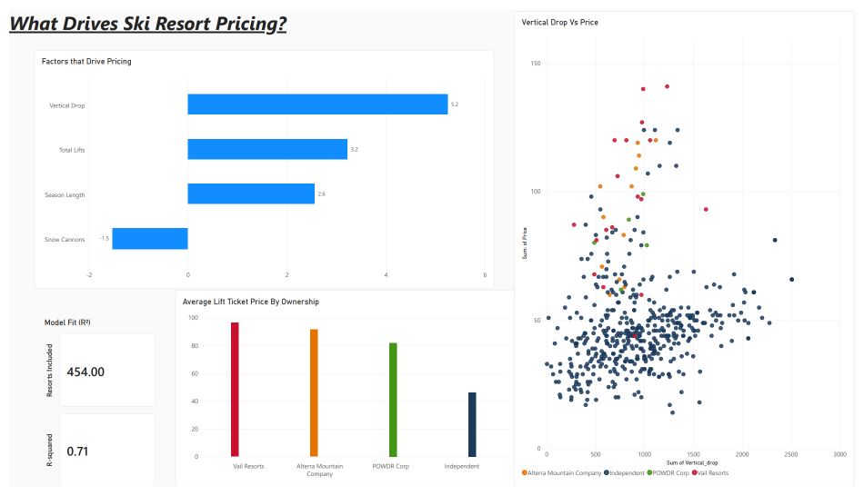

# What Drives Ski Resort Pricing?

**Tools:** R (tidyverse), Power BI
**Dashboard:** see screenshot below, or open `ski_resort_pricing_dashboard.pbix` in Power BI Desktop (free)
**Roadmap:** `Ski_Pricing_Case_Study_Roadmap.docx` in this repo
**R scripts:** `01_process_clean_and_tag_ownership.R` through `05_model_stats.R`

## Intro

This is a personal project built to dig into a question I was genuinely curious about: what actually drives the price of a ski pass, and is the ski industry's ongoing consolidation into a few big conglomerates showing up in the pricing? I also used it to build out R and Power BI skills that my first portfolio project (the Cyclistic bike-share capstone) didn't cover, that one was SQL and Tableau.

## The Question

Using a public dataset of about 500 ski resorts worldwide, I wanted to answer two things:

1. Out of everything measurable about a resort (elevation, snowmaking, night skiing, terrain parks, season length, region), which single characteristic is the biggest driver of price?
2. Does resort ownership matter? Specifically: do resorts owned by Vail Resorts, Alterra Mountain Company, or POWDR Corp charge more than independently owned resorts?

## Data

Resort data came from Maven Analytics' free Data Playground (source: Ski-resort-stats.com and NASA Earth Observations, public domain license). Ownership wasn't in the original dataset, I added that myself by cross-referencing each resort against the current public resort lists published by Vail, Alterra, and POWDR.

## Process

Cleaned and tagged the data in R, including fixing an encoding issue in the raw file (special characters like the "ä" in "Andermatt" were getting garbled) and catching a subtle Unicode matching bug where one resort's ownership tag silently failed to apply due to a byte-level character mismatch, not a visible typo. Full details and the fix are documented in the roadmap and in the script comments.

## Analysis

Built a linear regression predicting resort price from vertical drop, season length, snow cannons (a proxy for snowmaking investment), total lifts, amenities, continent, and ownership, with the numeric predictors standardized so every coefficient is directly comparable. The model explains about 71% of the variation in price (R² = 0.71) across 454 resorts.

**Findings:**

- **Vertical drop is the strongest single resort characteristic driving price.** More elevation range, higher price, consistently and by a wide margin.
- **Snow cannons had a surprising negative relationship with price.** Rather than being a premium amenity, snowmaking appears to be something lower-elevation resorts rely on to compensate for weaker natural snow, not something that commands a higher price.
- **Ownership matters, a lot.** Independent resorts charge significantly less than all three major conglomerates. Among the majors themselves, Vail Resorts commands the highest premium, with Alterra and POWDR in the middle tier.
- **Region matters even more than any single resort characteristic.** Which continent a resort is in swings price more than vertical drop does, which likely reflects broader market economics rather than anything about the mountain itself.

## Dashboard

Built in Power BI: a chart of the standardized regression coefficients (which factor matters most), average price by ownership, and a scatter plot of vertical drop against price, colored by ownership so the conglomerate/independent pricing gap is visible at a glance.

## Conclusion

Vertical drop is the clearest individual driver of ski resort pricing, but it's not the whole story. Region and ownership structure explain just as much, if not more. As the industry keeps consolidating around a handful of large operators, independent resorts currently sit at a real pricing gap relative to the conglomerates, worth watching as either an opportunity or a warning sign for how long that independence is sustainable.

## Sources

Data: [Maven Analytics Data Playground](https://mavenanalytics.io/data-playground/ski-resorts)
Ownership info: public resort lists published by Vail Resorts, Alterra Mountain Company, and POWDR Corp
